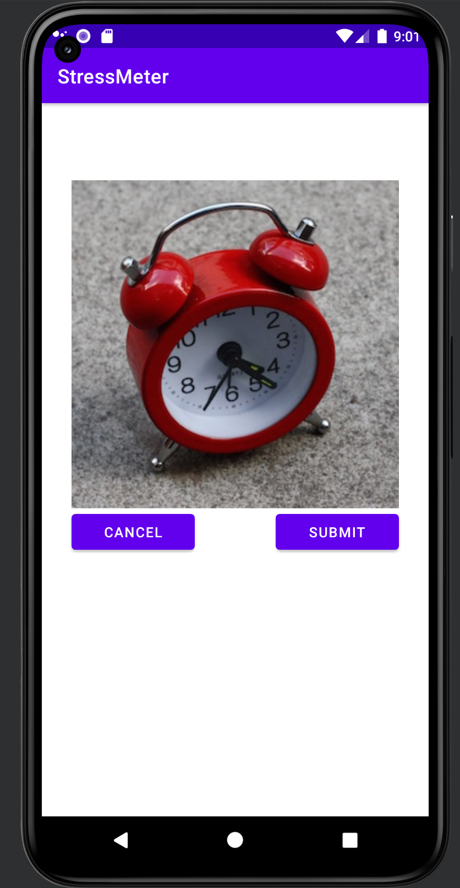
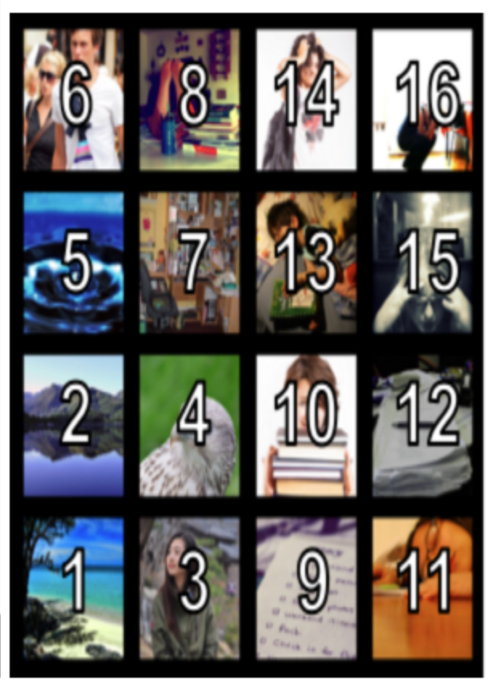
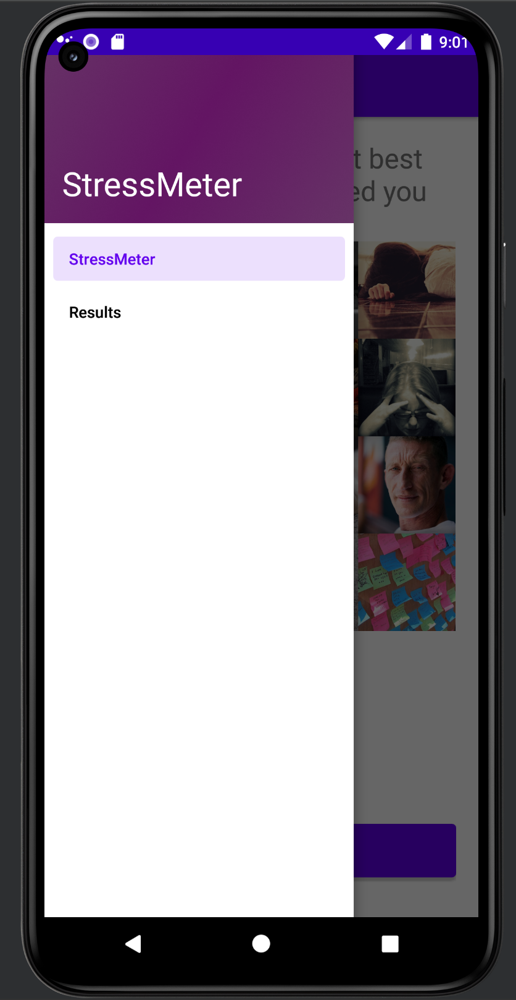
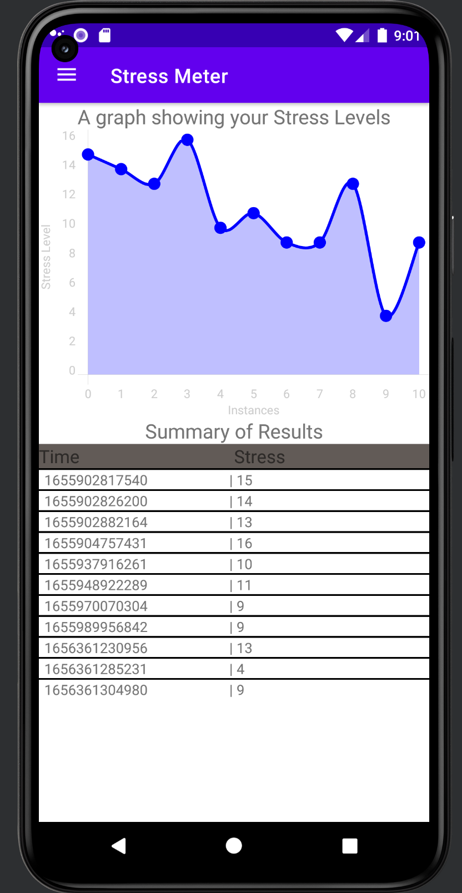

# StressMeter
Description: Through the vibration and music when opening the app to stimulate the pressure, based on the first feeling to choose the picture that appears on the screen to measure the pressure value. Provide pressure value records and visual tables.

# Usage
Install .apk files on Android phone.  
[Download link](https://github.com/HaojieHuang-Ryan/StressMeter/tree/v1.1.0)

# Introduction

The GridView of images are presented as shown in Figure 1. The user can select an image on the page or request “more images” by tapping on the “more images” button. There are 3 pages with 16 unique images in total.

If the user selects an image then a larger version of the image is presented to the user, as shown in Figure 2. At this point the user can select or cancel. If the user selects the score is computed and stored in a file (stress_timestamp.csv) and the app is no longer visible to the user.

Figure 3 shows the score associated with the grid position.

You can switch between StessMeter GridView, and the visualization of the stress data by using the NavigationView, as shown in Figure 5.

You should visualize the data that is being stored in the csv file by reading the data from the .csv file, and using the graph plotting library to plot the graphs, as shown in Figure 4. Furthermore, you also display a table showing the stress meter score and timestamp. Once you try out the app this will all become clear.
